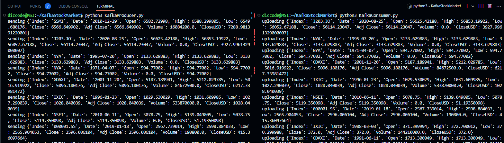
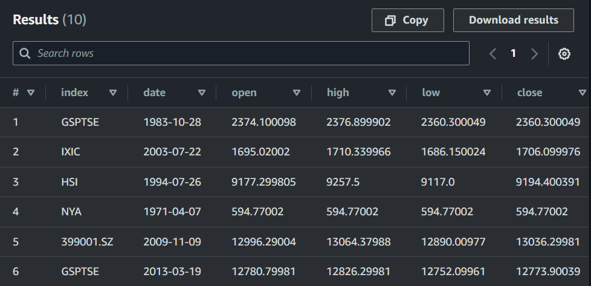

# Kafka Stock Market Project
Project based on Darshil Parmar Youtube Video [Stock Market Real-Time Data Analysis Using Kafka](https://www.youtube.com/watch?v=KerNf0NANMo)

What is Kafka? Learn here [Kafka Visualizaiton](https://softwaremill.com/kafka-visualisation/)
# Architechture


Image from [here](https://github.com/darshilparmar/stock-market-kafka-data-engineering-project)
# Steps
**1. [Installing Kafka on AWS EC2](#installing-kafka-on-aws-ec2)**
**2. [Create Producer](#create-producer)**
**3. [Create Consumer](#create-consumer)**
**4. [Running Producer and Consumer](#running-producer-and-consumer)**
**5. [Setup Amazon Glue and Athena](#setup-amazon-glue-and-athena)**


# Installing Kafka on AWS EC2
**1. Launch new AWS EC2 instance**
- Named it "kafka-stock-market-project". Choose Ubuntu AMI. Don't forget to create key pair and save it 
**2. Login with SSH client**
- Go to folder where you save .pem file. Then change the permision to read-only
```bash
    chmod 400 kafka-stock-market-project.pem
```

- Then login with SSH, change ec2-instance with your own instance

```bash
    ssh -i "kafka-stock-market-project.pem" ec2-instance
```
**3. Download Apache Kafka**
- Check latest kafka version [here](https://kafka.apache.org/downloads)
```bash
    wget https://downloads.apache.org/kafka/3.5.1/kafka_2.13-3.5.1.tgz
    tar -xvf kafka_2.13-3.5.1.tgz
```
**4. Install Java**
```bash
    sudo apt-get update
    sudo apt-get install openjdk-8-jdk
    java -version
```
**5. Change Listener Config**
```bash
    cd kafka_2.13-3.5.1
    sudo nano config/server.properties
```
- Change this settings, it configure where the client should communicate (within or outside EC2)
```bash
    listeners=INTERNAL://0.0.0.0:9092,EXTERNAL://0.0.0.0:9093
    advertised.listeners=INTERNAL://172.31.47.74:9092,EXTERNAL://13.51.196.19:9093
    listener.security.protocol.map=INTERNAL:PLAINTEXT,EXTERNAL:PLAINTEXT
    inter.broker.listener.name=INTERNAL
```
- This advertised.listener used by other broker (ex: local PC) to be address which is used to communicate with Kafka

**Side Note**
- In general, the address in the **advertised.listeners** configuration is the one Kafka uses for all outbound communications and the one it tells clients and other brokers to use for inbound communications.
- This **listener** configuration determines on which network interfaces and ports the Kafka broker will accept incoming connections.

**6. Start Zookeeper**
```bash
    bin/zookeeper-server-start.sh config/zookeeper.properties 
```
**7. Start Kafka**
```bash
    export KAFKA_HEAP_OPTS="-Xmx256M -Xms128M"
```
```bash
    bin/kafka-server-start.sh config/server.properties 
```

- In case you wanna stop the server, use this command
```bash
    bin/kafka-server-stop.sh
    bin/zookeeper-server-stop.sh
```
**8. Edit Security Setting**
- This step allow all request from local PC to AWS EC2 instance (not best practice for security)
- On your AWS EC2 instance go to Security -> Click on Security Group -> Edit inbound rules -> Add rule
    - Type: All traffic
    - Source: My IP

**8. Create Topic**
```bash
    bin/kafka-topics.sh --create --topic demo_testing --bootstrap-server localhost:9092 --replication-factor 1 --partitions 1
```
- Or it will automatically created when Kafka Producer send message to the Kafka broker

- To List topics
```bash
    bin/kafka-topics.sh --bootstrap-server localhost:9092 --list
```

# Create Producer
**1. On local PC, install Kafka Python library**
```bash
    pip install kafka-python
```

**2. Create KafkaProducer.py to make dummy producer using csv stock market data**
- Don't forget to change **bootstrap_servers** to your external **advertise.listener**
```python
    import pandas as pd
    from kafka import KafkaProducer
    from time import sleep
    from json import dumps
    import json

    producer = KafkaProducer(bootstrap_servers=['13.51.196.19:9093'],
                            value_serializer = lambda x: dumps(x).encode('utf-8'))
                            # why do we need utf-8 encoding? because kafka need byte string, not regular string

    df = pd.read_csv('indexProcessed.csv')

    while True:
        stock_dict = df.sample(1).to_dict(orient="records")[0]
        producer.send("stock", value=stock_dict)
        sleep(1)
```

# Create Consumer
**1. Configure AWS IAM on local machine**
- Go to IAM -> Users -> Create user -> Attach policies directly -> Add *AdministratorAccess* -> Next -> Create User
- On the created user, create *access key* and save the .csv file
- Install AWS CLI
```bash
curl "https://awscli.amazonaws.com/awscli-exe-linux-x86_64.zip" -o "awscliv2.zip"
unzip awscliv2.zip
sudo ./aws/install
aws --version
```
- Run 'aws configure' and insert aws *access key* from downloaded .csv file
```bash
aws configure
```

**2. Create AWS S3 Bucket**
- Create S3 bucket with unique name on AWS
- Install S3 library on local machine
```bash
    pip install s3fs
```
**3. Create KafkaConsumer.py that consume data and send it to S3**
- Don't forget to change **bootstrap_servers** to your external **advertise.listener**
```python
    from kafka import KafkaConsumer
    from time import sleep
    from json import dumps, loads
    import json
    from s3fs import S3FileSystem

    consumer = KafkaConsumer(
        'stock',
        bootstrap_servers=['13.51.196.19:9093'],
        value_deserializer = lambda x: loads(x.decode('utf-8'))
    )

    s3 = S3FileSystem()

    for count, i in enumerate(consumer):
        with s3.open("s3://your-bucket-name/stock_market_{}.json".format(count), 'w') as file:
            json.dump(i.value,file)
```

# Running Producer and Consumer
- Run both script in different terminal. Dummy stock data will be produced and json data will be uploaded to S3 bucket by the consumer
```bash
    python3 KafkaProducer.py
```
```bash
    python3 KafkaConsumer.py
```
- The result will look like this (if printed in console)


# Setup Amazon Glue and Athena
- Now the data is placed in S3 bucket, we can query it in **Amazon Athena** but first we should add its metadata to **Amazon Glue Data Catalog**

**1. Setup The Amazon Glue Crawler**
- This step will crawl the entire S3 file schema. So we can directly do query on top of it using AWS Athena.
- Add new crawler
    - AWS Glue -> Data Catalog -> Crawlers -> Create crawler -> Named it -> Add data source -> Chose your S3 bucket path (with closing slash "/") ->
    - Set IAM Options (create new) -> Amazon IAM -> Roles -> Create role -> Type: AWS Service and Service: Glue -> Add *AdministratorAccess* -> Select created IAM role ->
    - Add database -> Create new -> Select created database
- Select Crawler & run it

**2. Setup The Amazon Athena**
- Go to query editor
- Go to settings -> manage -> add new extra S3 bucket path for temporary query (if not exist, create one)
- Select previous created database and **query it**!
```SQL
    SELECT * FROM "stock_market_kafka"."kafka_stock_market_diccode" limit 10;
```

Voila! Here is our data

