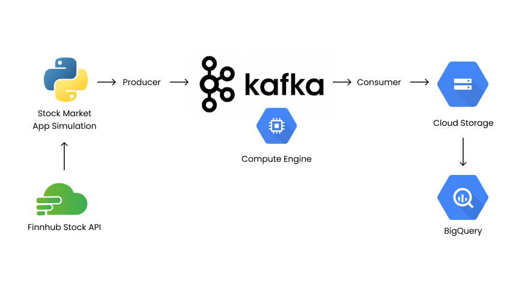
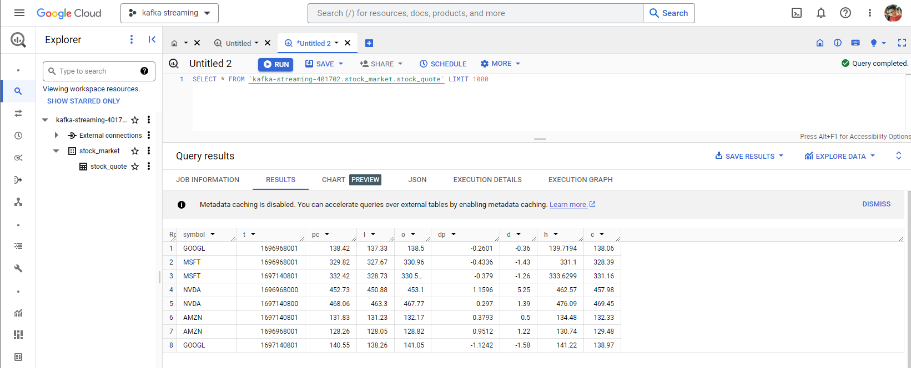

# Kafka Stock Market Project
Project based on Darshil Parmar Youtube Video [Stock Market Real-Time Data Analysis Using Kafka](https://www.youtube.com/watch?v=KerNf0NANMo).
Here we will create Kafka Streaming project that produce stock market data from an API, consume it to the Google Cloud Storage. Then query it in Google BigQuery.

What is Kafka? Learn here [Kafka Visualizaiton](https://softwaremill.com/kafka-visualisation/)
# Architechture


# Steps
**1. [Installing Kafka on GCE](#installing-kafka-on-GCE)**

**2. [Create Producer](#create-producer)**

**3. [Setup Google Cloud Storage](#setup-google-cloud-storage)**

**4. [Create Consumer](#create-consumer)**

**5. [Running Producer and Consumer](#running-producer-and-consumer)**

**6. [Query Using BigQuery](#query-using-bigquery)**

# Installing Kafka on GCE
**1. Create Instance & Access Through SSH**
- Create Compute Engine VM on Google Cloud Platform
    - Operating System: Ubuntu
    - Access scopes: Allow full access to all Cloud APIs
    - Fireall: Allow HTTP traffic, Allow HTTPS traffic
- On local terminal, [create SSH Key](https://cloud.google.com/compute/docs/connect/create-ssh-keys)
```bash
ssh-keygen -t rsa -f ~/.ssh/FILENAME -C USERNAME -b 2048
```
- Add public key in `~/.ssh/FILENAME.pub` to `Compute Engine/Metadata/SSH KEYS/ADD SSH KEY`
- Login to VM via SSH from local terminal, specify the VM External IP Address
```bash
ssh -i ~/.ssh/FILENAME USERNAME@EXTERNAL_IP
```

- Some tips for keeping SSH session alive [here](https://unix.stackexchange.com/questions/200239/how-can-i-keep-my-ssh-sessions-from-freezing)

**2. Install Kafka**
- In VM, download latest kafka version [here](https://kafka.apache.org/downloads)
```bash
wget https://downloads.apache.org/kafka/3.5.1/kafka_2.13-3.5.1.tgz
tar -xvf kafka_2.13-3.5.1.tgz
```
- Install Java
```bash
sudo apt-get update
sudo apt-get install openjdk-8-jdk
java -version
```
- Change Listener Config
```bash
cd kafka_2.13-3.5.1
sudo nano config/server.properties
```
- Change this settings, it configure where the client should communicate (within or outside GCE), change the `EXTERNAL_IP`
```bash
listeners=INTERNAL://0.0.0.0:9092,EXTERNAL://0.0.0.0:9093
advertised.listeners=INTERNAL://localhost:9092,EXTERNAL://EXTERNAL_IP:9093
listener.security.protocol.map=INTERNAL:PLAINTEXT,EXTERNAL:PLAINTEXT
inter.broker.listener.name=INTERNAL
```
**3. Create Custom Firewall Rule**
- Navigate to `VPC network/Firewall/CREATE FIREWALL RULE`
- Give your rule a name, and under "Targets", select "All instances in the network".
- Under "Source IP ranges", input `YOUR_IP_ADDRESS`/32 to allow traffic from your local terminal. Check your IP [here](http://whatismyip.akamai.com/) 
- Under "Protocols and ports", select "Specified protocols and ports", then mark TCP and input `9092,9093` to allow TCP traffic on ports 9092 and 9093
- Check if it is works
```bash
telnet EXTERNAL_IP 9093
```

**4. Start Zookeper**
```
bin/zookeeper-server-start.sh config/zookeeper.properties 
```

**5. Start Kafka Server**
```
bin/kafka-server-start.sh config/server.properties 
```

For stopping
```
bin/kafka-server-stop.sh
bin/zookeeper-server-stop.sh
```

**6. Create Topic**
- We can create topic manually, topic also can be automatically created by the Producer.
```
bin/kafka-topics.sh --create --topic demo_testing --bootstrap-server localhost:9092 --replication-factor 1 --partitions 1
```

To list topics
```
bin/kafka-topics.sh --bootstrap-server localhost:9092 --list
```

# Create Producer
**1. Install Kafka Python Library**
- Install on local terminal
```bash
pip install kafka-python
```

**2. Get Finnhub API Key**
- Sign up to https://finnhub.io/ to get free API Key
- Finnhub offer 60 request limit each minute

**3. Create KafkaProducer.py as Producer Script**
- Don't forget to change the `EXTERNAL IP`
```python
from kafka import KafkaProducer
import os, json
from dotenv import load_dotenv
import time
import finnhub

# Define producer
producer = KafkaProducer(bootstrap_servers=['EXTERNAL_IP:9093'],
                         value_serializer = lambda x: json.dumps(x).encode('utf-8'))
                        # why do we need utf-8 encoding? because kafka need byte string, not regular string

# Define finnhub client
load_dotenv(dotenv_path='key/finnhub.env') # Load the .env file
api_key = os.getenv('FINNHUB_API_KEY') # Get the API key
finnhub_client = finnhub.Client(api_key=api_key)

# Define request function
def getStock(symbol):
    stock_quote = {}
    try:
        stock_quote = finnhub_client.quote(symbol)
        stock_quote["symbol"] = symbol
    except Exception as e:
        print(f"Error fetching quote for {symbol}: {e}")
    return stock_quote

stock_symbols = ['NVDA', 'AMZN', 'GOOGL', 'MSFT']
while True:
    for symbol in stock_symbols:
        try:
            stock_dict = getStock(symbol)
            producer.send("stock", value=stock_dict)
            print(f"Sending: {json.dumps(stock_dict, indent=2)}")
        except Exception as e:
            print(f"Producer error: {e}")
    time.sleep(60)

```

# Setup Google Cloud Storage
The consumer will consume data that sent by producer, then upload the data to Google Cloud Storage.

**1. Create GCS Bucket**
- Select project, in the Console navigate to Google Cloud Storage
- Go to Buckets then click "Create"

**2. Create New Service Account**
To access GCS Bucket, we need permission, this is obtained from *service account*
- At Console, navigate to IAM & Admin
- Go to Service Account, then click "Create"
- Assign role of "Storage Object Admin" under "Grant this service account access to project"
- Create and download JSON Key:
    - Click on available Service Account, go to "Keys" tab
    - Click on "ADD KEY" then choose JSON
    - Save the downloaded JSON file, this will be used in consumer script. 

# Create Consumer
**1. Install Cloud Storage Library in Python**
```
pip install google-cloud-storage
```
**2. Create KafkaConsumer.py as Consumer Script**
- Don't forget to change the `EXTERNAL IP` and `.json` file path
```python
from kafka import KafkaConsumer
from time import sleep
import json
import json
from google.cloud import storage

# Initialize consumer
consumer = KafkaConsumer(
    'stock',
    bootstrap_servers=['EXTERNAL_IP:9093'],
    value_deserializer = lambda x: json.loads(x.decode('utf-8'))
)

# Initialize a GCS client
bucket_name = 'kafka-stock-quote'
storage_client = storage.Client.from_service_account_json('json-key-file.json')
bucket = storage_client.bucket(bucket_name)

for message in consumer:
    filename = message.value['t']
    symbol = message.value['symbol']

    blob_name = f'stock_market_{filename}_{symbol}.json'
    blob = bucket.blob(blob_name)

    # Convert message value to JSON string
    json_data = json.dumps(message.value)
    # Upload the data
    blob.upload_from_string(json_data)
    print(f"Uploading {message.value}")
```

# Running Producer and Consumer
Run both script in different terminal on local machine. 
```bash
python3 KafkaProducer.py
```
```bash
python3 KafkaConsumer.py
```

Now the Producer will ingest data from the API, Kafka will take it and forward to Consumer, and then Consumer will dump the data to GCS. Data will be streamed from API to GCS.

# Query Using BigQuery
Data that we dumped to GCS can be queryied using BigQuery, with `External Table`.

**1. Create External Table**
For reference, [here](https://cloud.google.com/bigquery/docs/external-data-cloud-storage#console)
Here is the step to create External Table using Console:
- Go to BigQuery, in the Explorer pane, create or select dataset.
- Expand the "three dot" action, click "Create Table":
    - **Create table from**: Google Cloud Storage
    - **Select file from GCS bucket or use a URI pattern**: Browse the file and use asterisk (*) wildcard character, example: `gs://mybucket/file_name*`, for choosing multiple files
    - **Destination**: Give table name and appropiate Project & Dataset name
    - **Table type**: External table
    - **Schema**: Select Auto detect (for simplicity)

**2. Query It!**

We already have the table, then query it like usual table.

