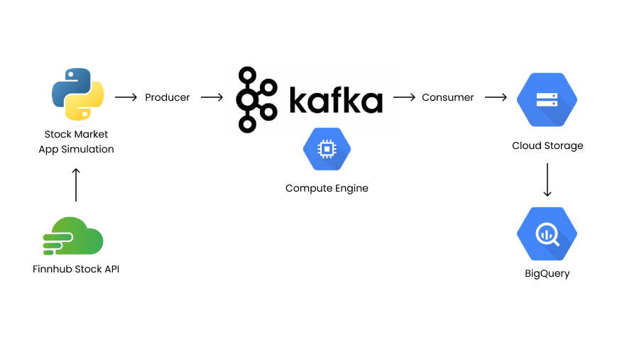

# Kafka Stock Market Project
Project based on Darshil Parmar Youtube Video [Stock Market Real-Time Data Analysis Using Kafka](https://www.youtube.com/watch?v=KerNf0NANMo).
Here we will create Kafka Streaming project that produce stock market data from an API, consume it to the Google Cloud Storage. Then query it in Google BigQuery.

What is Kafka? Learn here [Kafka Visualizaiton](https://softwaremill.com/kafka-visualisation/)
# Architechture

# Steps
**1. [Installing Kafka on GCS](#installing-kafka-on-gcs)**

**2. [Create Producer](#create-producer)**

**3. [Create Consumer](#create-consumer)**

**4. [Running Producer and Consumer](#running-producer-and-consumer)**

